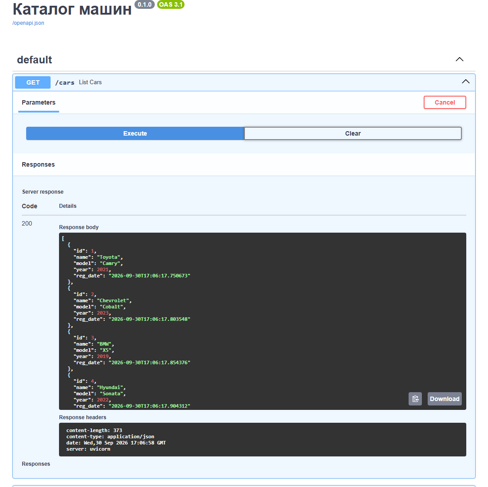

# Каталог машин

Небольшой REST-каталог автомобилей на FastAPI: поиск по марке и модели, пагинация, карточка машины. Добавлять и удалять записи может только владелец админ-ключа.

[](LICENSE)
[](https://github.com/tgKishikaisei/Machine_catalog_on_FastAPI/actions/workflows/ci.yml)



## API

| Метод | Путь | Доступ | Что делает |
|---|---|---|---|
| GET | `/cars?q=&limit=&offset=` | все | список с поиском по марке и модели |
| GET | `/car/{id}` | все | одна машина |
| POST | `/add-car` | заголовок `X-API-Key` | добавить машину, поля проверяет Pydantic |
| DELETE | `/car/{id}` | заголовок `X-API-Key` | удалить машину |

Ключ сравнивается в постоянном времени (`hmac.compare_digest`). Пустой `ADMIN_API_KEY` запрещает изменения совсем.

## Стек

Python 3.12, FastAPI, SQLAlchemy 2, Pydantic 2. SQLite по умолчанию, PostgreSQL через `DATABASE_URL`.

## Запуск

```bash
git clone https://github.com/tgKishikaisei/Machine_catalog_on_FastAPI.git
cd Machine_catalog_on_FastAPI
python -m venv venv
venv\Scripts\activate               # Linux и macOS: source venv/bin/activate
pip install -r requirements.txt
cp .env.example .env                 # ADMIN_API_KEY, чтобы добавлять и удалять машины
uvicorn main:app --reload
```

Swagger: http://127.0.0.1:8000/docs.

## Тесты

```bash
pip install -r requirements-dev.txt
pytest
```

## Живая версия

Публичного стенда нет, проект запускается локально.

## Лицензия

[MIT](LICENSE) © 2023-2026 Behruz Avezmatov
